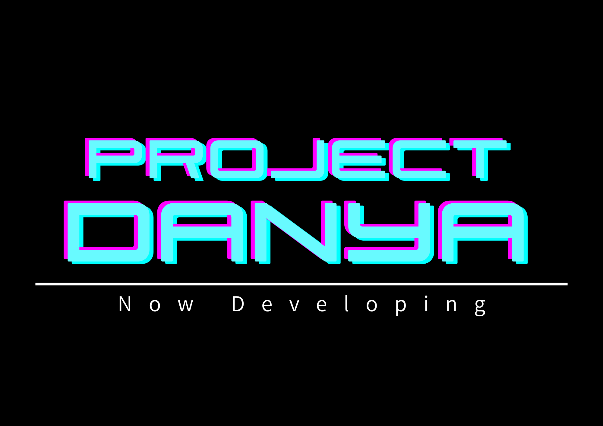

<p align="center">
  
</p>

# Project DANYA

DANYAは、人間とロボットの間にある「自然な対話」を研究するためのアバター/音声/LLM連携プロジェクトです。現在のリポジトリには、MediaPipeで顔の動きを取得してアバターへ反映するアプリ、LLM出力を受けてGPT-SoVITSで読み上げる会話アバター、TTSサーバー、デモ用の仮LLMサーバーが入っています。

## 主要アプリ

| ファイル | 役割 |
| --- | --- |
| `mediapipe_face_avatar.py` | MediaPipe Face Landmarkerから表情・顔向きデータを取り、`avatar.glb` に反映する単体アバターアプリ |
| `danya_conversation_avatar.py` | LLM出力APIを受信し、TTS音声・表情・口パク・YOLO視線制御を行う会話アバター |
| `gpt_sovits_tts_server.py` | GPT-SoVITSをHTTP APIとして動かすTTSサーバー |
| `gpt_sovits_tts_client.py` | TTSサーバーへリクエストし、WAV保存・再生を行うクライアント |
| `demos/llm_output_demo_server.py` | `<emotion_tag>本文` を20秒ごとに返すデモ用LLM出力サーバー |
| `demos/browser_face_demo.html` | Three.jsでGLBの顔表示と口パクを確認するブラウザデモ |

## セットアップ

```bash
python3 -m venv .venv
source .venv/bin/activate
pip install -r requirements.txt
```

MediaPipeアプリは初回起動時にFace Landmarkerモデルを `.cache/` にダウンロードします。ネットワークがない環境では、先にモデルをキャッシュしておいてください。

## MediaPipeアバター

カメラ映像から顔を検出し、MediaPipeのblendshapeをアバターの表情へ反映します。

```bash
.venv/bin/python mediapipe_face_avatar.py
```

主な用途:

- MediaPipeの表情データ取得確認
- アバターGLBの表情パラメータ確認
- プロジェクション表示や顔だけ表示の調整

## 会話アバター

LLM出力サーバーの `/api/output?since=<seq>` をポーリングし、`outputs` に入った文字列をTTSへ渡します。

```bash
.venv/bin/python danya_conversation_avatar.py
```

既定値:

- LLM出力サーバー: `http://127.0.0.1:8767`
- ポーリング間隔: `20` 秒
- TTSサーバー: `http://192.168.73.239:8000`
- YOLOプレビュー: OFF

設定例:

```bash
DANYA_LLM_OUTPUT_SERVER=http://192.168.186.180:8767 \
DANYA_TTS_SERVER=http://192.168.73.239:8000 \
.venv/bin/python danya_conversation_avatar.py
```

YOLOプレビューを見たい場合:

```bash
DANYA_YOLO_PREVIEW=1 .venv/bin/python danya_conversation_avatar.py
```

## デモ用LLMサーバー

本物のLLMサーバーがない時に、仮の出力を20秒ごとに返します。

```bash
.venv/bin/python demos/llm_output_demo_server.py
```

すぐ1件出してテストしたい場合:

```bash
.venv/bin/python demos/llm_output_demo_server.py --immediate
```

確認用URL:

```text
http://127.0.0.1:8767/api/health
http://127.0.0.1:8767/api/output?since=0
```

レスポンス例:

```json
{
  "outputs": [
    "<happy|mid>こんにちは、今日もええ感じに動いてるね。次は何を話そっか。"
  ],
  "latest_seq": 1
}
```

## GPT-SoVITS TTSサーバー

GPT-SoVITSのモデルを読み込み、`/tts` と `/tts_batch` を提供します。モデルパスは `gpt_sovits_tts_server.py` 内の固定設定を使います。

```bash
.venv/bin/python gpt_sovits_tts_server.py
```

tmuxで監視付き起動する場合:

```bash
scripts/start_tts_tmux.sh
```

API:

- `GET /health`
- `GET /refs`
- `POST /tts`
- `POST /tts_batch`

## ディレクトリ構成

```text
Project-DANYA/
├── logo.png
├── README.md
├── requirements.txt
├── mediapipe_face_avatar.py
├── danya_conversation_avatar.py
├── gpt_sovits_tts_server.py
├── gpt_sovits_tts_client.py
├── assets/
│   └── models/
│       ├── avatar.glb
│       ├── avatar_nohair.glb
│       └── avatar_without_animation.glb
├── data/
│   └── animation_data.json
├── demos/
│   ├── browser_face_demo.html
│   └── llm_output_demo_server.py
├── scripts/
│   ├── start_tts_tmux.sh
│   └── tts_server_supervisor.sh
└── tools/
    └── check_wav.py
```

`runtime/` と `.cache/` は実行時に作られる作業ディレクトリです。ログ、TTS音声、ウィンドウ状態、MediaPipeモデルキャッシュなどが入ります。

## 開発メモ

- LLM出力形式は `<emotion_tag>本文` です。
- `happy|mid` と `happy_mid` の両方を受け付けます。
- `mid` と `low` はTTS参照音声では `normal` に正規化されます。
- 会話アバターはLLM受信ログを出します。不要な場合は `DANYA_LLM_OUTPUT_DEBUG=0` を指定してください。

## Author

Daniil Malchenko  
Kanazawa Institute of Technology  
Department of Information and Computer Engineering
